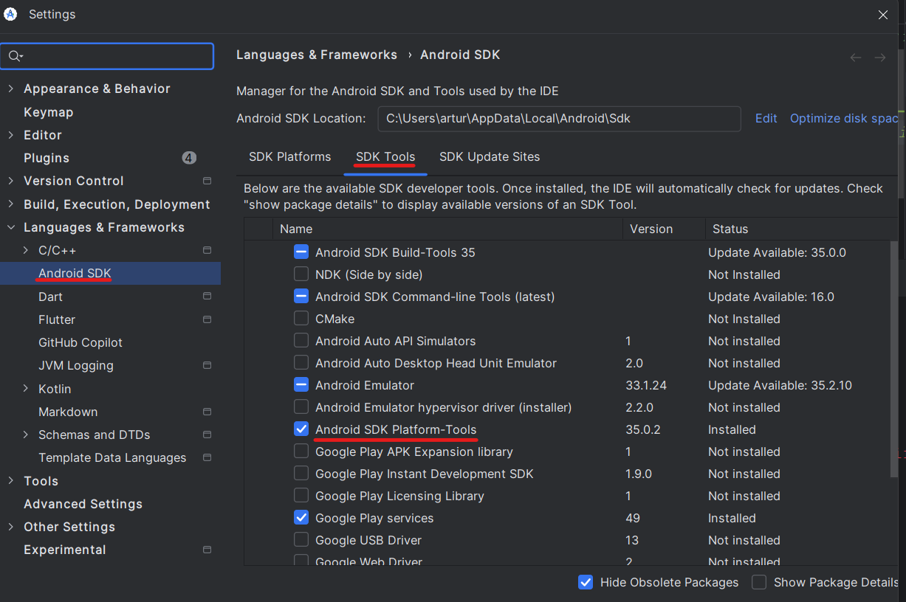

# Configuring the Environment

Before starting the development process, we are going to set up our environment. 
To set up the environment, the following steps must be completed: 
- Install necessary tools
- Configure the Git environment

## Tools
Given that the focus of this book is not on those tools, they will be listed 
with only enough information, adding any additional information as external 
resources.

- **Git**: Used as source version control. 
    - <a href="https://git-scm.com/downloads" target="_blank">Download and install</a>
    - <a href="https://git-scm.com/doc" target="_blank">Documentation</a>
        - <a href="https://git-scm.com/docs" target="_blank">Reference Manual</a>
        - <a href="https://git-scm.com/book/" target="_blank">Book</a>
        - <a href="https://training.github.com/" target="_blank">Cheat Sheet</a>
    - Important repositories: <a href="https://github.com/flutter/flutter" target="_blank">Flutter</a>, <a href="https://github.com/join-the-flock/flock" target="_blank">Flock</a>
- **Integrated Development Environment (IDE)**: there are a lot of IDEs out there, but two are very popular among flutter developers. Install the IDE with the Flutter plugin for each: 
    - <a href="https://docs.flutter.dev/tools/android-studio" target="_blank">Android Studio</a>
    - <a href="https://docs.flutter.dev/tools/vs-code" target="_blank">Visual Studio Code</a>
- **Python**: Some tools require that you have Python installed on your machine.
    - <a href="https://www.python.org/downloads/" target="_blank">Download and install</a>
- **Android Platform Tools**: Android SDK Platform-Tools is a component for the Android SDK. It includes tools that interface with the Android platform, primarily adb and fastboot. Although adb is required for Android app development, app developers will normally just use the copy Studio installs.
    - **Android Studio on Windows**: Usually, the Android SKD Platform-Tools are in the path: `C:\Users\<your_user>\AppData\Local\Android\Sdk\platform-tools`
    - **Activate those tools from your Android Studio** following the path `Tools/SDK Manager/Android SDK/SDK Tools`:
    
    - <a href="https://developer.android.com/tools/releases/platform-tools" target="_blank">Download</a> if you are not using the version from your IDE.
    

